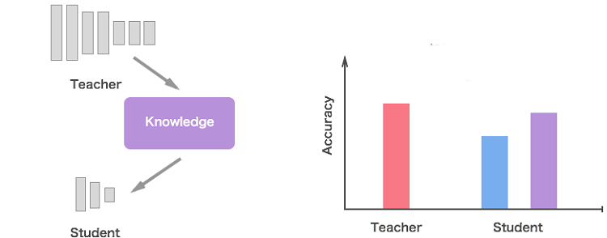

# 知识蒸馏

<strong>知识蒸馏</strong>（a.k.a Teacher-Student Model)旨在利用一个小模型（Student）去学习一个大模型（Teacher）中的知识，
期望小模型尽量保持大模型的性能，来减小模型部署阶段的参数量，加速模型推理速度，降低计算资源使用。

# 目录结构
- 1.参考[Distilling the Knowledge in a Neural Network](http://arxiv.org/abs/1503.02531) (Hinton et al., 2015),
在cifar10数据上的复现，提供一个对Knowledge Distillation的基本认识，具体代码在[Knowledge_Distillation_From_Scratch.ipynb](Knowledge_Distillation_From_Scratch.ipynb)
- 2.利用BERT-12 作为Teacher，BERT-3作为student，同时学习ground truth 和 soften labels，性能与Teacher相当甚至更优，详情请参考：[knowledge_distillation_bert](https://github.com/xv44586/Knowledge-Distillation-NLP/knowledge_distillation_bert.py)
  
  主要参考论文：
  - [Distilling Task-Specific Knowledge from BERT into Simple Neural Networks](http://arxiv.org/abs/1903.12136) 
  - [TinyBERT: Distilling BERT for Natural Language Understanding](http://arxiv.org/abs/1909.10351)
  - [DistilBERT, a distilled version of BERT: smaller, faster, cheaper and lighter](http://arxiv.org/abs/1910.01108)